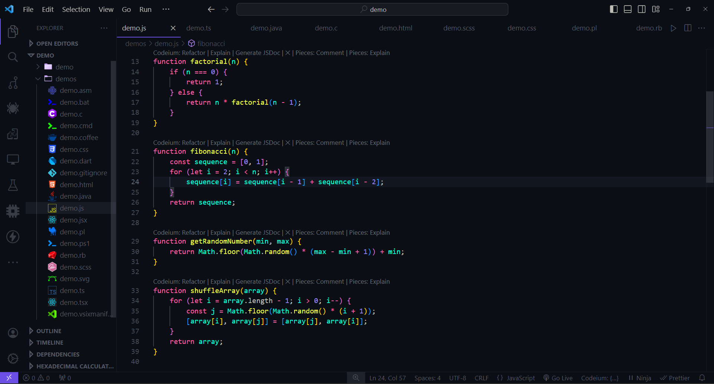

# PRAS Spectrum Theme

PRAS Spectrum Theme is a vibrant and versatile theme extension for Visual Studio Code, designed to enhance your coding experience with its rich and colorful palette.

## Features

- Dark mode support with vibrant colors
- Productive coding environment with carefully selected syntax highlighting
- Extensive file icon support for over 200 file formats
- Customized UI elements for a seamless coding experience

## Installation

1. Open Visual Studio Code.
2. Go to the Extensions view by clicking on the square puzzel icon in the sidebar or by pressing `Ctrl+Shift+X` (Windows/Linux) or `Cmd+Shift+X` (macOS).
3. Search for "PRAS Spectrum Theme".
4. Click on the Install button.

## Usage

1. **Installation**: After installing the extension, navigate to the settings by clicking on the gear icon in the sidebar.

2. **Select Theme**: In the settings, click on "Themes" and choose "Color Theme", "Icon Theme", and "Product Icon Theme".

3. **Choose PRAS Spectrum Theme**: From the dropdown menus, select "PRAS Spectrum Theme" for each.

4. **Enjoy Coding**: Once set up, immerse yourself in the vibrant colors and productive coding environment provided by PRAS Spectrum Theme!

## Contributing

Contributions are welcome! If you encounter any issues, have suggestions for improvements, or would like to request additional features for this extension, please feel free to open an issue or submit a pull request on [GitHub](https://github.com/PRASSamin/PRAS-Spectrum-Theme.git).

## License

This project is licensed under the MIT License - see the [LICENSE](LICENSE) file for details.

---

**Enjoy your coding experience with PRAS Spectrum Theme!**

